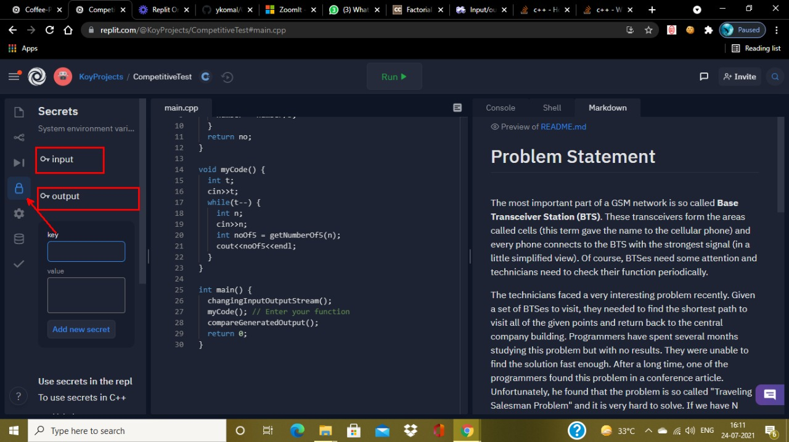
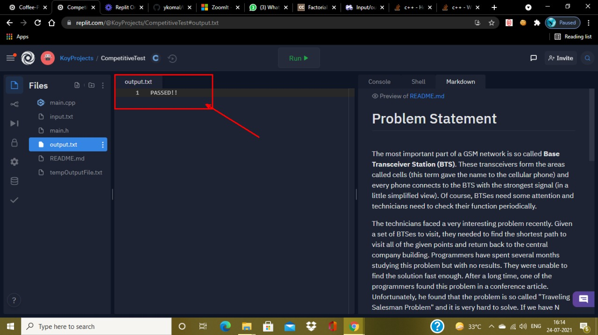
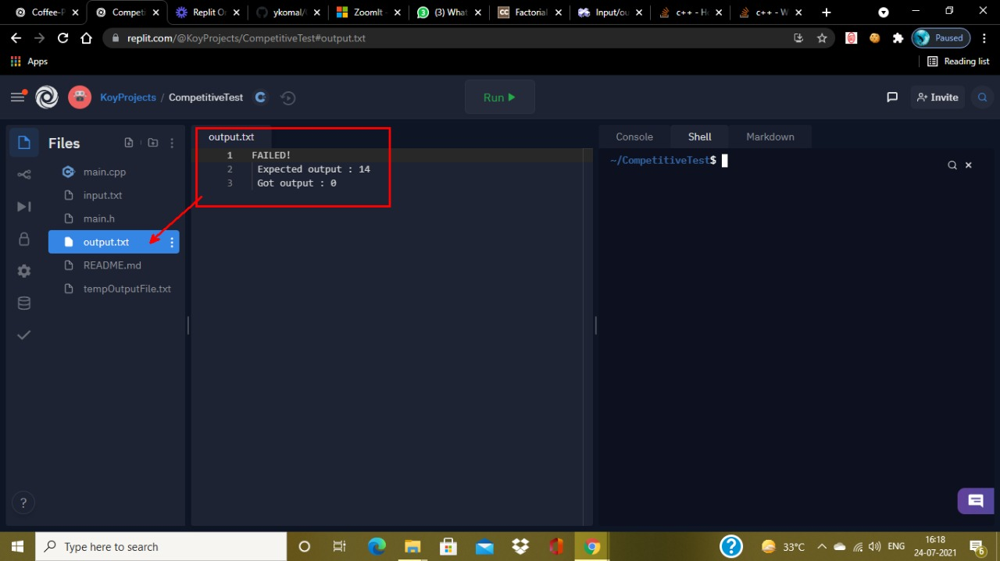

# Competitive Practice

# How to use?

* Fork this repo

* Open [replit](https://replit.com/) and the team where you want to add the new replit. In the secrets section add 2 secrets as shown : 
  * input - containing the set of inputs to be used to test the code against
  * output - containing the expected output of the code


* The [output](./output.txt) file can show 2 types of outputs as shown : 
  * **Passed!!** - When the output generated by user code matched the expected output
  
  * **Failed** - When it does not match against some inputs
  
  
* Users are required to add the code in main.cpp file under the : ``` /** Add your code here **/ ``` section

* In case the users want to test their outputs against standard input the ``` #include "main.h" ``` directive can be removed. It however needs to be added later to test against the secrets

* Remove the **How to Use** section and the **images folder**. Update the problem statement

# Problem Statement

<br/>

*Describe the problem statement here in detail*

```
Input:
! Explain input and necessary constraints
```

```
Output:
! Explain output and necessary constraints
```

```
Sample Input: 
6
3
60
```

```
Sample Output: 
0
14
```